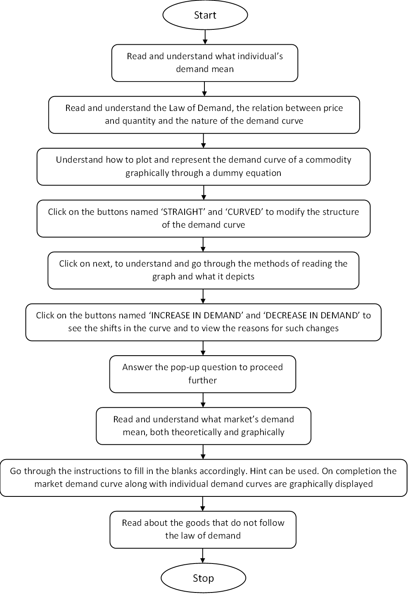

## Storyboard (Round 2)

Experiment : Law of Demand

### 1. Story Outline:

Our study of market economies requires us to examine both the demand-side and the supply-side of product and resources markets. Buyers and sellers interact with one another to engage in mutually beneficial exchanges in a market economy, and prices are set based on the demand and supply for a particular good, service or resource. This experiment presents the law of demand, and explains how the demand curve can illustrate this fundamental economic concept.

### 2. Story:

The law of demand is one of the most fundamental principles in economics. It gives the relationship between the price of a commodity and its quantity demanded, when all factors other than price remains unchanged. The relationship mentioned above when represented diagrammatically, it gives rise to the demand curve. This experiment uses the graphical representation of the demand curve to discuss about its formation, meaning, shift and many more. 

#### 2.1 Set the Visual Stage Description:
The main screen of the simulator consists of two blocks placed horizontally in a sequence. The left, bigger block consists of the drawing area that consists of the graph, while the right, smaller block consists of pop-up texts that describe the on-going changes or the upcoming changes on the left block.

#### 2.2 Set User Objectives & Goals:
-	Define what individual’s demand is for a particular commodity. 
-   Demonstrate how various quantity at a particular price value is used to create the demand curve.
-   Understand how generalisation is done for the demand curve.
-   Choose the structure of demand curve to proceed with.
-   Interpret the demand curve by reading the curve both horizontally and vertically.
-   Select the type of shift in the demand curve to know the reasons behind it.
-   Define what market’s demand is for a particular commodity.
-   Calculate the values from the data provided and fill in the market demand table.
-   List the names of commodities that do not follow the law of demand.

#### 2.3 Set the Pathway Activities:

1.	The set-up consists of two blocks placed sequentially in a horizontal manner. The left part consists of all the graphic changes while the right part describes those changes.
2.	To produce the demand curve, an equation can be used to plot the curve on a graph. 
3.	Additionally, the different structures of the curve can be explored by clicking on the ‘straight’ or ‘curved’ buttons respectively.
4.	The different methods of reading the graph can be understood by clicking on the triangular shaped next button.
5.	The shifts in the curve and its corresponding reasons can be identified by clicking on the ‘increase in demand’ and the ‘decrease in demand’ buttons.
6.	Once the market demand is understood, calculations are made to complete the market demand table for a sample commodity.
7.	Exceptions to the law of demand are noted down and explained.

#### 2.4 Set Challenges and Questions/Complexity/Variations in Questions:

Q 1. The price of 1 kg apples, which was $5 last month, is $6 today. The demand curve for apples must have shifted rightward between last month and today. State True or False 
a. true 
**b. false**   

Q 2. The individual’s demand curve for a commodity represents 
**a. a maximum boundary of the individual’s intentions** 
b. a minimum boundary of the individual’s intentions 
c. both a maximum and a minimum boundary of the individual’s intentions 
d. neither a maximum nor a minimum boundary of the individual’s intentions  

Q 3. When an individual’s income rises (while everything else remains the same), that person’s demand for a normal good 
**a. rises** 
b. falls 
c. remains the same 
d. any of the above  

Q 4. When an individual’s income falls (while everything else remains the same), that person’s demand for an inferior good  
**a. increases** 
b. decreases 
c. remains unchanged 
d. we cannot say without additional information  

Q 5. When the price of a substitute of commodity X falls, the demand for X 
a. rises 
**b. falls** 
c. remains unchanged 
d. any of the above  

Q 6. When both the price of a substitute and the price of a complement of commodity X rise, the demand for X  
a. rises 
b. falls  
c. remains unchanged 
**d. all of the above are possible**   

##### 2.5 Allow pitfalls: Yes

The market demand schedule creation allows pitfalls. It provides the user two chances to enter the data into the table correctly after which the correct values are displayed by the simulator itself. Hints are also allowed to be viewed at any time.

#### 2.6 Conclusion:
The approximate time required to understand the procedure and to start performing the experiment would take about 10 mins. To understand the questions, calculating the data and entering them into their respective input boxes will take approximately another 12 min. To answer the assessment questions, it will take around 5-10 mins. Therefore, in total, to understand and complete the experiment, it will take around 27-32 min.

## 2.7 Equations/formulas:
The relation between the price of a commodity and the quantity in demand is a linear relation. Therefore, equations of the form **QDX = a – bPX** are used to describe the individual’s demand. 
[where, QDX stands for the quantity in demand, PX stands for the price of the commodity]

### 3. Flowchart :

### 4. Mindmap:

### 5. Storyboard :

