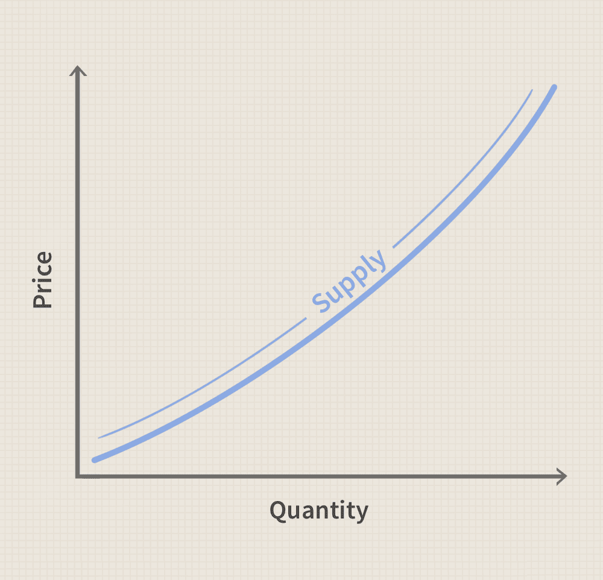

### INTRODUCTION  

#### Individual Supply 
*
Supply is a producer-side concept. It is an economic principle referring to a consumer's desire to purchase goods and services and willingness to pay a price for a specific good or service.
  Individual supply describes the willingness of an individual firm to provide a specific quantity of a good or service to the market over a given period of time. It is a function of or depends on the price of the commodity and the producer’s cost of production. If factors such as technology, the prices of the inputs necessary to produce the commodity and for agricultural commodities, climate, weather conditions are kept constant while varying the price of the commodity, then, we get the individual producer’s supply schedule and supply curve, respectively.
*

#### Market's Supply
*
The market or aggregate supply of a commodity gives the alternative amounts of the commodity supplied per time period at various alternative prices by all the producers of this commodity in the market. The market supply of a commodity depends on all the factors that determine the individual producer’s supply and, in addition, on the number of producers of the commodity in the market.
  Geometrically, the market’s supply curve is obtained by the horizontal summation of all the individual’s supply curves for the commodity.
*

 

### FORMULA

The relation between the price of a commodity and the quantity supplied is a linear relation. Therefore, equations of the form **QSX = –a + bPX** are used to describe the individual’s supply. 
Where:
-   **QSX** stands for the quantity supplied,
-   **a** stands for the factors that influence supply (except price),
-   **b** stands for the slope,
-   **PX** stands for the price of the commodity.

 

### GRAPHICAL REPRESENTATION

 The graphic representation of the correlation between the cost of a good or service and the quantity supplied for a given period is referred to as the supply curve. In a typical illustration, the price will appear on the left vertical axis, while the quantity supplied will appear on the horizontal axis.

**Below is an examle of a supply curve:** 
 

 
